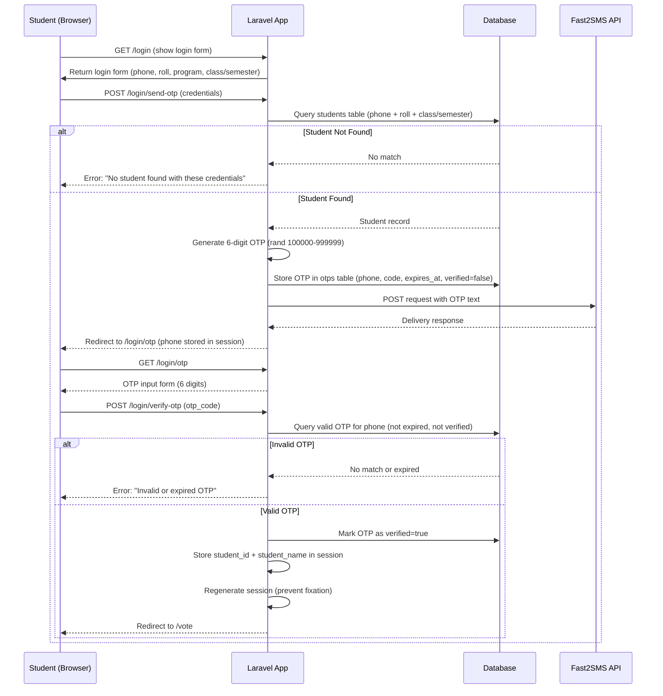
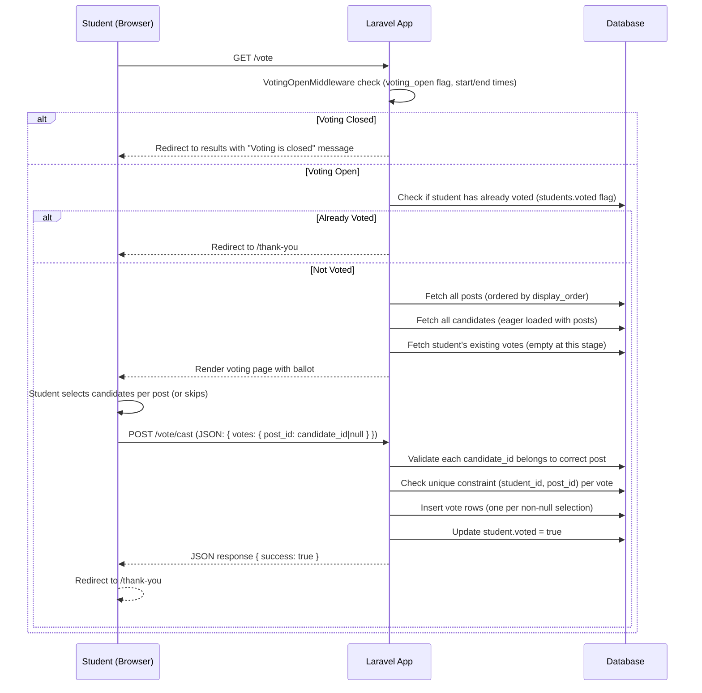
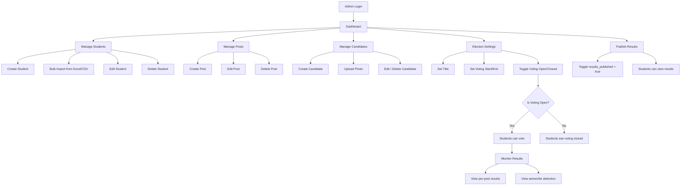
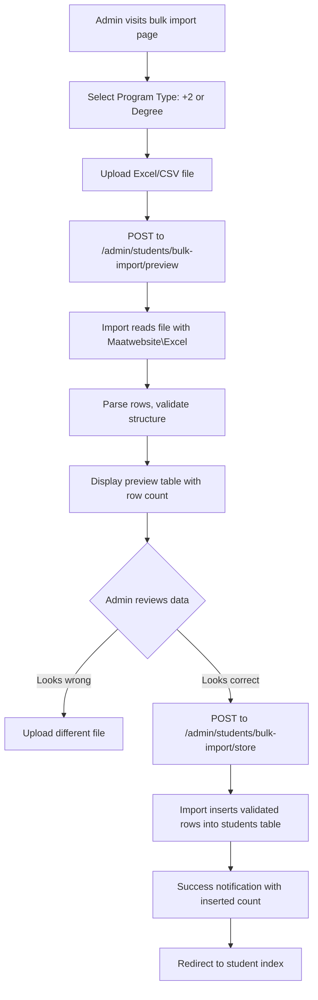

# College Voting System — Documentation

## Table of Contents

1. [System Overview](#1-system-overview)
2. [Technology Stack](#2-technology-stack)
3. [System Architecture](#3-system-architecture)
4. [Entity-Relationship Diagram](#4-entity-relationship-diagram)
5. [Database Schema](#5-database-schema)
6. [Data Flow Diagrams](#6-data-flow-diagrams)
7. [Route Reference](#7-route-reference)
8. [Authentication System](#8-authentication-system)
9. [SMS Service Architecture](#9-sms-service-architecture)
10. [Frontend Pages](#10-frontend-pages)
11. [Testing](#11-testing)
12. [Deployment Guide](#12-deployment-guide)

---

## 1. System Overview

The **College Voting System** is a web-based application that enables colleges to conduct secure digital elections for student union positions. It supports two distinct user roles with different access levels and responsibilities.

### Features

- **Student Management** — Add, edit, bulk import (via Excel/CSV), and delete students
- **Post Management** — Create election positions (e.g., President, Vice President) with custom display ordering
- **Candidate Management** — Register candidates per post with optional photo uploads
- **Election Lifecycle Control** — Admin opens/closes voting window with optional start/end schedule
- **OTP-based Authentication** — Students authenticate via phone + roll number with SMS-delivered OTP
- **Secure Voting** — One vote per student per post with abstention option
- **Real-time Results** — Automatic counting, winner/tie detection with animated progress bars
- **Bulk Import** — Upload student lists from Excel/CSV with preview before saving

### User Roles

| Role | Capabilities |
|------|-------------|
| **Admin** | Full CRUD on students, posts, candidates; manage election settings; publish/unpublish results; view all results |
| **Student** | Login via OTP; cast votes; view published results |

---

## 2. Technology Stack

| Layer | Technology |
|-------|-----------|
| **Backend Framework** | Laravel 12.x (PHP 8.2+) |
| **Frontend** | Blade templates with vanilla JavaScript |
| **CSS Framework** | Tailwind CSS v4 |
| **Build Tool** | Vite 7.x with `laravel-vite-plugin` and `@tailwindcss/vite` |
| **Database** | MySQL (production) / SQLite (development/testing) |
| **Authentication** | Laravel session auth (admin) + custom OTP-based session auth (students) |
| **SMS Service** | Fast2SMS (production) |
| **Excel Import** | maatwebsite/excel v3.1 |
| **Testing** | Pest PHP 3.x |
| **Queue / Cache / Session** | Database-driven |

### Key Composer Dependencies

- `laravel/framework` ^12.0
- `maatwebsite/excel` ^3.1
- `pestphp/pest` ^3.8 (dev)

### Key npm Dependencies

- `vite` ^7.0.7
- `tailwindcss` ^4.0.0
- `@tailwindcss/vite` ^4.0.0
- `axios` ^1.11.0

---

## 3. System Architecture

The application follows the **Model-View-Controller (MVC)** pattern as implemented by Laravel.

```
┌─────────────────────────────────────────────────────────────┐
│                       Browser (Client)                      │
│            Blade Templates + Vanilla JS + Tailwind          │
└───────────────────────┬─────────────────────────────────────┘
                        │ HTTP Requests (Session-based)
                        ▼
┌─────────────────────────────────────────────────────────────┐
│                    routes/web.php                           │
│          Route definitions → Middleware pipeline            │
└───────────┬──────────────────────────┬──────────────────────┘
            │                          │
            ▼                          ▼
┌───────────────────────┐  ┌──────────────────────────────┐
│  Admin Middleware      │  │  Student Middleware           │
│  (auth + role=admin)  │  │  (session student_id exists) │
└───────────┬───────────┘  └──────────┬───────────────────┘
            │                          │
            ▼                          ▼
┌───────────────────────┐  ┌──────────────────────────────┐
│  Admin Controllers     │  │  Student Controllers         │
│  (under App\Http\     │  │  (under App\Http\            │
│   Controllers\Admin)   │  │   Controllers\Student)      │
└───────────┬───────────┘  └──────────┬───────────────────┘
            │                          │
            └──────────┬───────────────┘
                       ▼
┌─────────────────────────────────────────────────────────────┐
│                    Models (App\Models)                      │
│  User, Student, Post, Candidate, Vote, Otp, ElectionSetting │
└──────────────────────────┬──────────────────────────────────┘
                           │ Eloquent ORM
                           ▼
┌─────────────────────────────────────────────────────────────┐
│                        Database                             │
│               MySQL (production) / SQLite (dev)            │
└─────────────────────────────────────────────────────────────┘
```

### Middleware Pipeline

| Middleware | Applied To | Purpose |
|------------|-----------|---------|
| `auth` | Admin routes | Laravel's built-in session auth |
| `admin` | Admin routes | Verifies `role === 'admin'` |
| `student` | Student routes | Verifies `session('student_id')` exists |
| `voting.open` | Vote routes | Checks `election_settings` voting window |

### Directory Structure (app/)

```
app/
├── Contracts/
│   └── SmsServiceInterface.php          # SMS contract
├── Http/
│   ├── Controllers/
│   │   ├── Controller.php               # Base controller
│   │   ├── Admin/
│   │   │   ├── CandidateController.php
│   │   │   ├── DashboardController.php
│   │   │   ├── ElectionSettingController.php
│   │   │   ├── PasswordController.php
│   │   │   ├── PostController.php
│   │   │   ├── ResultController.php
│   │   │   ├── StudentBulkImportController.php
│   │   │   └── StudentController.php
│   │   ├── Auth/
│   │   │   ├── AdminAuthController.php
│   │   │   └── StudentAuthController.php
│   │   └── Student/
│   │       ├── ResultController.php
│   │       └── VotingController.php
│   └── Middleware/
│       ├── AdminMiddleware.php
│       ├── StudentMiddleware.php
│       └── VotingOpenMiddleware.php
├── Imports/
│   └── StudentsPreviewImport.php        # Excel/CSV import logic
├── Models/
│   ├── Candidate.php
│   ├── ElectionSetting.php
│   ├── Otp.php
│   ├── Post.php
│   ├── Student.php
│   ├── User.php
│   └── Vote.php
├── Providers/
│   ├── AppServiceProvider.php
│   └── SmsServiceProvider.php           # Fast2SMS binding
└── Services/
    └── Fast2SmsService.php              # Production SMS driver
```

---

## 4. Entity-Relationship Diagram

```mermaid
erDiagram
    USERS {
        bigint id PK
        string name
        string email UK
        string password
        string phone
        string role
        timestamp email_verified_at
        timestamp created_at
        timestamp updated_at
    }

    STUDENTS {
        bigint id PK
        string name
        string phone UK
        string semester
        string class
        string roll_no
        boolean voted
        timestamp created_at
        timestamp updated_at
        UK(phone)
        UK(class, semester, roll_no)
    }

    POSTS {
        bigint id PK
        string name
        text description
        int display_order
        timestamp created_at
        timestamp updated_at
    }

    CANDIDATES {
        bigint id PK
        string name
        bigint post_id FK
        string semester
        string photo
        timestamp created_at
        timestamp updated_at
    }

    VOTES {
        bigint id PK
        bigint student_id FK
        bigint post_id FK
        bigint candidate_id FK
        timestamp created_at
        timestamp updated_at
        UK(student_id, post_id)
    }

    OTPS {
        bigint id PK
        string phone
        string otp_code
        timestamp expires_at
        boolean verified
        timestamp created_at
        timestamp updated_at
    }

    ELECTION_SETTINGS {
        bigint id PK
        string title
        boolean voting_open
        boolean results_published
        timestamp voting_start
        timestamp voting_end
        timestamp created_at
        timestamp updated_at
    }

    %% Relationships
    POSTS ||--o{ CANDIDATES : has
    CANDIDATES ||--o{ VOTES : receives
    STUDENTS ||--o{ VOTES : casts
    POSTS ||--o{ VOTES : contains
    STUDENTS ||--o{ OTPS : "generates (via phone)"
```

### Relationship Summary

| Parent | Child | Type | Foreign Key |
|--------|-------|------|-------------|
| `posts` | `candidates` | One-to-Many | `candidates.post_id` |
| `posts` | `votes` | One-to-Many | `votes.post_id` |
| `candidates` | `votes` | One-to-Many | `votes.candidate_id` |
| `students` | `votes` | One-to-Many | `votes.student_id` |
| `students` (via phone) | `otps` | One-to-Many | `otps.phone` |

**Constraint Notes:**
- A student can vote only **once per post** (`unique(student_id, post_id)` on votes)
- A candidate belongs to exactly one post
- A student's phone number is unique
- A combination of `(class, semester, roll_no)` is unique per student

---

## 5. Database Schema

### Table: `users`

Stores admin user credentials.

| Column | Type | Constraints | Notes |
|--------|------|-------------|-------|
| id | bigint | PK, auto-increment | |
| name | varchar(255) | NOT NULL | |
| email | varchar(255) | UNIQUE, NOT NULL | |
| email_verified_at | timestamp | NULLABLE | |
| password | varchar(255) | NOT NULL | bcrypt hashed |
| phone | varchar(255) | NULLABLE | Added via migration |
| role | varchar(255) | DEFAULT 'admin' | Added via migration |
| remember_token | varchar(100) | NULLABLE | |
| created_at | timestamp | NULLABLE | |
| updated_at | timestamp | NULLABLE | |

### Table: `students`

Stores student voter records.

| Column | Type | Constraints | Notes |
|--------|------|-------------|-------|
| id | bigint | PK, auto-increment | |
| name | varchar(255) | NOT NULL | |
| phone | varchar(255) | UNIQUE, NOT NULL | Used for OTP delivery |
| semester | varchar(255) | NULLABLE | e.g. '1st Sem', '3rd Sem', '5th Sem' (Degree students) |
| class | varchar(255) | NULLABLE | '11' or '12' (+2 students) |
| roll_no | varchar(255) | NOT NULL | |
| voted | boolean | DEFAULT false | Tracked via migration |
| created_at | timestamp | NULLABLE | |
| updated_at | timestamp | NULLABLE | |
| **UNIQUE** | (class, semester, roll_no) | | Composite unique |

### Table: `posts`

Defines election positions.

| Column | Type | Constraints | Notes |
|--------|------|-------------|-------|
| id | bigint | PK, auto-increment | |
| name | varchar(255) | NOT NULL | e.g. 'President', 'Vice President' |
| description | text | NULLABLE | |
| display_order | int | DEFAULT 0 | Ordering on ballot |
| created_at | timestamp | NULLABLE | |
| updated_at | timestamp | NULLABLE | |

Global scope orders by `display_order` ascending.

### Table: `candidates`

Stores candidates running for each post.

| Column | Type | Constraints | Notes |
|--------|------|-------------|-------|
| id | bigint | PK, auto-increment | |
| name | varchar(255) | NOT NULL | |
| post_id | bigint | FK → posts.id, ON DELETE CASCADE | |
| semester | varchar(255) | NULLABLE | |
| photo | varchar(255) | NULLABLE | Stored in `storage/app/public/candidates/` |
| created_at | timestamp | NULLABLE | |
| updated_at | timestamp | NULLABLE | |

### Table: `votes`

Records each ballot cast.

| Column | Type | Constraints | Notes |
|--------|------|-------------|-------|
| id | bigint | PK, auto-increment | |
| student_id | bigint | FK → students.id, ON DELETE CASCADE | |
| post_id | bigint | FK → posts.id, ON DELETE CASCADE | |
| candidate_id | bigint | FK → candidates.id, ON DELETE CASCADE | |
| created_at | timestamp | NULLABLE | |
| updated_at | timestamp | NULLABLE | |
| **UNIQUE** | (student_id, post_id) | | One vote per student per post |

If a student abstains from a post, no vote row is created for that post.

### Table: `otps`

Stores one-time passwords for student authentication.

| Column | Type | Constraints | Notes |
|--------|------|-------------|-------|
| id | bigint | PK, auto-increment | |
| phone | varchar(255) | INDEXED, NOT NULL | |
| otp_code | varchar(255) | NOT NULL | 6-digit code |
| expires_at | timestamp | NOT NULL | Invalid after this time |
| verified | boolean | DEFAULT false | Marked true after successful verification |
| created_at | timestamp | NULLABLE | |
| updated_at | timestamp | NULLABLE | |

### Table: `election_settings`

Controls the election lifecycle (singleton pattern — first row only).

| Column | Type | Constraints | Notes |
|--------|------|-------------|-------|
| id | bigint | PK, auto-increment | |
| title | varchar(255) | DEFAULT 'Students Union Election' | |
| voting_open | boolean | DEFAULT false | Master toggle |
| results_published | boolean | DEFAULT false | Visibility toggle for student results |
| voting_start | timestamp | NULLABLE | Scheduled open time |
| voting_end | timestamp | NULLABLE | Scheduled close time |
| created_at | timestamp | NULLABLE | |
| updated_at | timestamp | NULLABLE | |

### System Tables (Laravel Internals)

- `cache` / `cache_locks` — Database cache driver
- `jobs` / `job_batches` / `failed_jobs` — Database queue driver
- `sessions` — Database session driver
- `password_reset_tokens` — Password reset tokens

---

## 6. Data Flow Diagrams

### 6.1 Student Registration & OTP Login Flow



### 6.2 Voting Flow



### 6.3 Admin Election Lifecycle Flow



### 6.4 Bulk Student Import Flow



---

## 7. Route Reference

### Root

| Method | URI | Name | Description |
|--------|-----|------|-------------|
| GET | `/` | — | Redirects to `/login` |

### Admin Authentication (guest)

| Method | URI | Name | Description |
|--------|-----|------|-------------|
| GET | `/admin/login` | `admin.login` | Admin login form |
| POST | `/admin/login` | `admin.login.submit` | Handle admin login |
| POST | `/admin/logout` | `admin.logout` | Handle admin logout |

### Admin Panel (auth + admin middleware)

| Method | URI | Name | Controller@Method |
|--------|-----|------|-------------------|
| GET | `/admin/dashboard` | `admin.dashboard` | `DashboardController@index` |
| GET | `/admin/password` | `admin.password.edit` | `PasswordController@edit` |
| PUT | `/admin/password` | `admin.password.update` | `PasswordController@update` |
| GET | `/admin/students` | `admin.students.index` | `StudentController@index` |
| GET | `/admin/students/create` | `admin.students.create` | `StudentController@create` |
| POST | `/admin/students` | `admin.students.store` | `StudentController@store` |
| GET | `/admin/students/{student}` | `admin.students.show` | `StudentController@show` |
| GET | `/admin/students/{student}/edit` | `admin.students.edit` | `StudentController@edit` |
| PUT | `/admin/students/{student}` | `admin.students.update` | `StudentController@update` |
| DELETE | `/admin/students/{student}` | `admin.students.destroy` | `StudentController@destroy` |
| GET | `/admin/students/bulk-import` | `admin.students.bulk-import` | `StudentBulkImportController@index` |
| POST | `/admin/students/bulk-import/preview` | `admin.students.bulk-import.preview` | `StudentBulkImportController@preview` |
| POST | `/admin/students/bulk-import/store` | `admin.students.bulk-import.store` | `StudentBulkImportController@store` |
| GET | `/admin/students/bulk-import/template` | `admin.students.bulk-import.template` | `StudentBulkImportController@downloadTemplate` |
| DELETE | `/admin/students/bulk-delete` | `admin.students.bulk-destroy` | `StudentController@bulkDestroy` |
| GET | `/admin/posts` | `admin.posts.index` | `PostController@index` |
| GET | `/admin/posts/create` | `admin.posts.create` | `PostController@create` |
| POST | `/admin/posts` | `admin.posts.store` | `PostController@store` |
| GET | `/admin/posts/{post}/edit` | `admin.posts.edit` | `PostController@edit` |
| PUT | `/admin/posts/{post}` | `admin.posts.update` | `PostController@update` |
| DELETE | `/admin/posts/{post}` | `admin.posts.destroy` | `PostController@destroy` |
| GET | `/admin/candidates` | `admin.candidates.index` | `CandidateController@index` |
| GET | `/admin/candidates/create` | `admin.candidates.create` | `CandidateController@create` |
| POST | `/admin/candidates` | `admin.candidates.store` | `CandidateController@store` |
| GET | `/admin/candidates/{candidate}/edit` | `admin.candidates.edit` | `CandidateController@edit` |
| PUT | `/admin/candidates/{candidate}` | `admin.candidates.update` | `CandidateController@update` |
| DELETE | `/admin/candidates/{candidate}` | `admin.candidates.destroy` | `CandidateController@destroy` |
| GET | `/admin/results` | `admin.results.index` | `ResultController@index` |
| GET | `/admin/results/{post}` | `admin.results.post` | `ResultController@postDetail` |
| POST | `/admin/results/publish` | `admin.results.publish` | `ResultController@publish` |
| POST | `/admin/results/unpublish` | `admin.results.unpublish` | `ResultController@unpublish` |
| GET | `/admin/settings` | `admin.settings.edit` | `ElectionSettingController@edit` |
| PUT | `/admin/settings` | `admin.settings.update` | `ElectionSettingController@update` |
| POST | `/admin/settings/toggle-voting` | `admin.settings.toggle-voting` | `ElectionSettingController@toggleVoting` |

### Student Authentication (guest)

| Method | URI | Name | Description |
|--------|-----|------|-------------|
| GET | `/login` | `student.login` | Student login form |
| POST | `/login/send-otp` | `student.send-otp` | Validate credentials and send OTP |
| GET | `/login/otp` | `student.otp` | OTP verification form |
| POST | `/login/verify-otp` | `student.verify-otp` | Verify OTP and create session |
| POST | `/student/logout` | `student.logout` | Student logout |

### Student Portal (student middleware)

| Method | URI | Name | Middleware | Description |
|--------|-----|------|-----------|-------------|
| GET | `/vote` | `student.vote` | voting.open | Voting ballot page |
| POST | `/vote/cast` | `student.cast-vote` | voting.open | Submit votes (AJAX) |
| GET | `/thank-you` | `student.thank-you` | — | Post-voting confirmation |
| GET | `/results` | `student.results` | — | View published results |

---

## 8. Authentication System

### 8.1 Admin Authentication

The admin uses Laravel's standard session-based authentication.

```
Admin visits /admin/login
            │
            ▼
Submits email + password
            │
            ▼
AdminAuthController@login validates with Auth::attempt()
            │
            ▼
Check if user->role === 'admin'
   ┌───────┴───────┐
   │               │
  Yes              No
   │               │
   ▼               ▼
Create session   Logout, show error
   │
   ▼
Redirect to /admin/dashboard
```

**Default seeded credentials:** `admin@college.com` / `password`

**Password change:** Admin can update password via `/admin/password` (validates current password first).

### 8.2 Student OTP Authentication

Students authenticate via a two-step OTP flow without a persistent password.

#### Step 1: Credential Validation + OTP Send

```
Student provides: phone, roll_no, program_type (+2/Degree), class or semester
            │
            ▼
StudentAuthController@sendOtp queries students table
matching ALL fields
            │
   ┌───────┴───────┐
   │               │
  Found           Not Found
   │               │
   ▼               ▼
Generate 6-digit   Return error:
OTP (rand         "Student not found"
100000-999999)
   │
   ▼
Store OTP in otps table:
  phone, otp_code, expires_at (2 min), verified=false
   │
   ▼
Send SMS via Fast2SmsService
   │
   ▼
Store phone in session
Redirect to /login/otp
```

#### Step 2: OTP Verification

```
Student enters 6-digit OTP
            │
            ▼
StudentAuthController@verifyOtp
            │
            ▼
Query otps table:
  WHERE phone = session('otp_phone')
  AND otp_code = input
  AND verified = false
  AND expires_at > NOW()
            │
   ┌───────┴───────┐
   │               │
  Found           Not Found
   │               │
   ▼               ▼
Mark OTP          Return error:
verified=true     "Invalid or expired OTP"
   │
   ▼
Store student_id + student_name in session
Regenerate session ID (prevent fixation)
   │
   ▼
Redirect to /vote
```

#### OTP Resend

When the student requests a resend on the OTP page:
- Queries for any existing unverified OTP for the phone and marks it as expired
- Generates a new 6-digit OTP with a **5-minute** expiry
- Sends via Fast2SMS

### 8.3 Session Security

| Measure | Implementation |
|---------|---------------|
| Session driver | Database (config/session.php) |
| Session regeneration | On login and logout |
| CSRF protection | All POST routes include `@csrf` |
| Middleware isolation | Admin and student sessions are separate |
| Voting middleware | `VotingOpenMiddleware` checks both `voting_open` flag and datetime window |

### 8.4 Already Voted Prevention

- The `students.voted` boolean flag is checked in `VotingController@index` and `@castVote`
- On successful vote submission, `student.voted = true` is updated
- The flag prevents re-access to the voting page and double submissions

---

## 9. SMS Service Architecture

The SMS system uses an **interface-based design** for clean separation of concerns.

### Interface

```php
interface SmsServiceInterface
{
    public function send(string $to, string $message): bool;
}
```

### Implementation: Fast2SmsService

The application uses **Fast2SmsService** for all SMS delivery in both development and production environments.

**Configuration** (`.env`):
```
SMS_DRIVER=fast2sms
FAST2SMS_AUTHORIZATION=your_api_key_here
```

**Service Provider Binding** (`SmsServiceProvider`):
```php
$this->app->bind(
    SmsServiceInterface::class,
    Fast2SmsService::class
);
```

**API Endpoint:** Fast2SMS `bulkV2` endpoint

**Usage:** Called by `StudentAuthController@sendOtp` when delivering OTP codes to student phone numbers.

---

## 10. Frontend Pages

### Layouts

| Layout | File | Description |
|--------|------|-------------|
| Admin Layout | `resources/views/layouts/admin.blade.php` | Sidebar navigation + top bar + flash messages + confirmation modal |
| Student Layout | `resources/views/layouts/student.blade.php` | Gradient navbar + responsive hamburger menu + flash messages |

### Auth Pages

| Page | File | Description |
|------|------|-------------|
| Admin Login | `resources/views/auth/admin-login.blade.php` | Email + password with show/hide toggle; split layout with branding |
| Student Login | `resources/views/auth/student-login.blade.php` | Glassmorphism card; phone, roll, program type toggle, class/semester dropdowns |
| OTP Verification | `resources/views/auth/student-otp.blade.php` | 6-digit OTP input fields with auto-focus and resend button |

### Admin Pages

| Page | File | Description |
|------|------|-------------|
| Dashboard | `admin/dashboard.blade.php` | 4 stat cards (students, posts, candidates, votes) + election status + quick actions |
| Students Index | `admin/students/index.blade.php` | Search, filter by class/semester, pagination, bulk delete checkbox |
| Student Create | `admin/students/create.blade.php` | Form with +2/Degree toggle affecting class/semester field |
| Student Edit | `admin/students/edit.blade.php` | Same form, pre-populated |
| Bulk Import | `admin/students/bulk-import.blade.php` | File upload + program type + AJAX preview table |
| Posts Index | `admin/posts/index.blade.php` | Table with candidate count per post |
| Post Create/Edit | `admin/posts/create.blade.php`, `edit.blade.php` | Name + description + display order |
| Candidates Index | `admin/candidates/index.blade.php` | Filterable by post, shows photo thumbnail |
| Candidate Create/Edit | `admin/candidates/create.blade.php`, `edit.blade.php` | Name + post select + photo upload |
| Results | `admin/results/index.blade.php` | Per-post progress bars, percentages, numeric counts, winner/tie badges, publish controls |
| Post Detail | `admin/results/post-detail.blade.php` | Detailed breakdown for a single post |
| Settings | `admin/settings/edit.blade.php` | Voting toggle, title, start/end datetime, results publish (danger zone) |
| Change Password | `admin/password/edit.blade.php` | Current + new password confirmation |

### Student Pages

| Page | File | Description |
|------|------|-------------|
| Voting Ballot | `student/voting.blade.php` | Post-by-post layout with candidate cards, radio selection, skip option, ballot tracker, confirmation modal, AJAX submission |
| Thank You | `student/thank-you.blade.php` | Confirmation with decorative elements, links to results/logout |
| Results | `student/results.blade.php` | Three states (voting ongoing / not yet published / published), animated progress bars, winner/tie detection |
| Voting Closed | `student/voting-closed.blade.php` | Informational page when voting window is closed |

### JavaScript (Vanilla JS)

All client-side interactivity is implemented in vanilla JavaScript:

| Component | Location | Functionality |
|-----------|----------|---------------|
| Mobile nav toggle | `layouts/student.blade.php` | Hamburger menu open/close |
| Password show/hide | `auth/admin-login.blade.php` | Toggle password field visibility |
| OTP input auto-focus | `auth/student-otp.blade.php` | Auto-advance between 6 digit inputs + paste support |
| Confirm modal | `layouts/admin.blade.php` | Generic confirmation dialog for destructive actions |
| Voting app | `student/voting.blade.php` | Candidate selection, ballot tracker, confirmation modal, AJAX submission with Axios |
| Bulk import preview | `admin/students/bulk-import.blade.php` | AJAX upload + preview table rendering |
| Result filters | `admin/results/index.blade.php` | Post selection filtering |

### CSS

- **Tailwind CSS v4** — Utility-first framework for all styling
- **Custom styles** — Minimal custom CSS via Tailwind's `@apply` directives in `resources/css/app.css`
- **Responsive design** — Mobile-first with Tailwind breakpoints

---

## 11. Testing

### Framework

The project uses **Pest PHP 3.x** for testing, configured in `phpunit.xml` and `tests/Pest.php`.

### Test Files

```
tests/
├── Feature/
│   ├── AdminPasswordChangeTest.php     # Admin password update validation
│   ├── ExampleTest.php                 # Basic application smoke test
│   ├── ResultTieTest.php               # Tie detection logic in results
│   ├── StudentLoginTest.php            # Student OTP auth flow
│   ├── StudentManagementTest.php       # CRUD operations for students
│   ├── StudentResultTest.php           # Student result viewing
│   └── VotingWindowTest.php            # Voting open/close constraints
├── Unit/
│   └── ExampleTest.php                 # Unit test example
├── Pest.php                            # Pest configuration
└── TestCase.php                        # Base test case class
```

### Test Coverage Areas

| Test | Description |
|------|-------------|
| Student Login | Validates OTP generation, verification, invalid credentials, expired OTP |
| Voting Window | Ensures voting is only accessible when open, redirects when closed |
| Results / Tie | Tests proper winner detection, tie scenario handling |
| Student Management | CRUD operations, validation rules, unique constraints |
| Admin Password | Current password validation, password update |

### Running Tests

```bash
php artisan test
# or
./vendor/bin/pest
```

---

## 12. Deployment Guide

### Prerequisites

- PHP 8.2+
- Composer 2.x
- MySQL 8.x (or SQLite for development)
- Node.js 20+ (for frontend assets)
- A Fast2SMS API account

### Environment Setup

1. **Clone the repository**

```bash
git clone <repository-url>
cd college-voting-system
```

2. **Install dependencies**

```bash
composer install --no-dev --optimize-autoloader
npm install
npm run build
```

3. **Configure environment**

```bash
cp .env.example .env
php artisan key:generate
```

4. **Database configuration** (`.env`)

```env
DB_CONNECTION=mysql
DB_HOST=127.0.0.1
DB_PORT=3306
DB_DATABASE=college_voting
DB_USERNAME=root
DB_PASSWORD=your_password
```

5. **SMS configuration** (`.env`)

```env
SMS_DRIVER=fast2sms
FAST2SMS_AUTHORIZATION=your_fast2sms_api_key
```

6. **Run migrations and seeders**

```bash
php artisan migrate --seed
```

This creates the database schema and seeds:
- Default admin user (`admin@college.com` / `password`)
- Default election settings
- Optional dummy data (via `DummyDataSeeder`)

7. **Create storage link**

```bash
php artisan storage:link
```

8. **Queue worker** (for SMS dispatching)

```bash
php artisan queue:work database &
```

Or configure a supervisor process for production.

9. **Web server**

Point your web server to the `public/` directory. For Apache, ensure `mod_rewrite` is enabled (`.htaccess` included). For Nginx:

```nginx
location / {
    try_files $uri $uri/ /index.php?$query_string;
}
```

### First-Time Admin Access

1. Visit `/admin/login`
2. Login with: `admin@college.com` / `password`
3. Navigate to **Settings** to configure the election title and voting window
4. Add posts (e.g., President, Vice President) under **Posts**
5. Register candidates under **Candidates**
6. Import students under **Students → Bulk Import**
7. Open voting from the **Settings** page or **Dashboard** quick actions
8. After voting concludes, publish results from **Results**

### Security Notes

- Change the default admin password immediately after first login
- The `.env` file must never be committed to version control
- Use HTTPS in production
- Regularly backup the database
- Rotate the Fast2SMS API key periodically

---

*Generated from codebase analysis — College Voting System*
